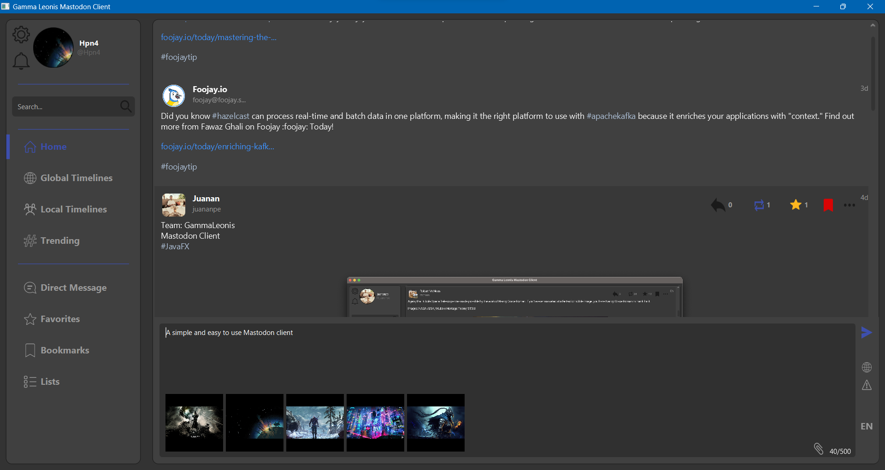
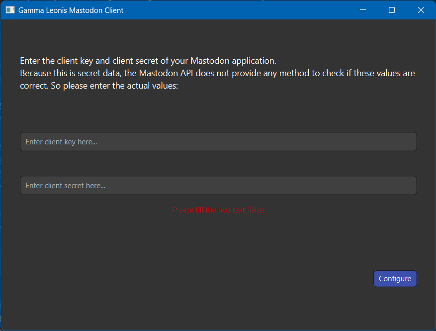
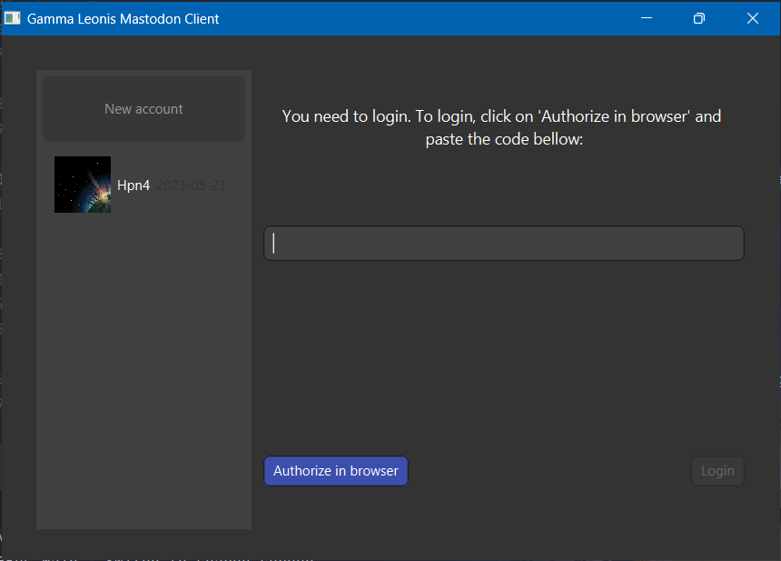

# Gamma Leonis Mastodon Client

This project is a Client for the [Mastodon](https://joinmastodon.org/) social network made with JavaFX and Maven.
The application is available in French, Spanish and English.

Installers can be found for MacOS, Linux and Windows in the [Action](https://github.com/Hpn4/Gamma_Leonis-mastodonFX/actions) section.

## 1. UI

The main window is composed of 4 parts:
- The left scroll pane is the navigation bar. It contains the buttons to switch between the different views.
- The left top sections contains the search bar, the setting gear and notification bell button.
- The center pane is the main view. It contains the view of the selected button in the navigation bar.
- The bottom bar contains the panel to send a toot.

## 2. Pre-requisites

When you first run the client, you will have to enter the client key and the client secret of your Mastodon application.
To create an application, you have to go to the settings of your Mastodon account and click on the "Development" tab.
Then you have to click on the "New application" button and fill the form. 
**You must enable the "read", "write", "follow" and "push" scopes.**

It can take a little time when you click on 'Configure'.

---

## 3. Account switching

Our client support multiple accounts. To change from one account to another one they are two ways:
1. When you opened the client for the first time.
2. By clicking on the setting gear button on the main window

In booth cases, you will have a login screen with saved accounts on a left scroll pane.
And a login form on the right.

To add an account, you need to click on the button 'Authorize in browser' and you will be redirected to the Mastodon website.
Then you will have to login in mastodon and authorize the application. Mastodon will give you a code that you will have to copy and paste in the client.

---

## 4. Implemented use case

Personal:
- Home timeline, favourited and bookmarked toots, notifications.
- Multiple accounts management.

Account:
- Follow/unfollow accounts.
- Remove an account from your followers.
- Profile of account (posted toots, followers, following, avatar, etc.)

Search and trending:
- You can search for toots, accounts and hashtags.
- You can see the trending hashtags and toots in the trending section.

Toots action:
- Favourite/unfavourite, bookmark/unbookmark, boost/unboost, reply.
- Delete (only if it's your own toot).
- Link, hashtag and mention redirection
- Image, video, audio and gifv are supported.
- Content warning with blurred image.

Send toot:
- Warning content/spoiler is supported.
- You can send a toot in PUBLIC (everyone can see it) or DIRECT (only the mentioned users can see it).
- You can attach media to your toot (image, video, audio):
  - You can attach multiple media to your toot in one or more times.
  - You can remove media from your toot by clicking on his thumbnail.

## 5. Technical details

- We use Hibernate and JPA to manage the database.
- We use log4j in order to log the errors (saved in `logs/app.log`).
- We use JUnit to test the api.
- We have created installers for MacOS, Linux and Windows with Github Actions.
- We have created our own API library to communicate with the Mastodon API.
- We use JSoup to parse toot.
- We use internationalization and localization to support multiple languages:
  - English
  - French
  - Spanish

---

## 6. Documents

- Mockup (for UI) are located in the folder `docs` and are made with [Draw.io](https://draw.io/).
- A use case diagram, a domain model and a sequence diagram are located in the folder `docs` and are made with [StarUML](https://staruml.io/).
